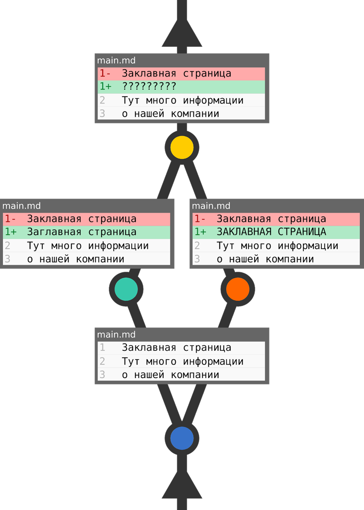

# Конфликты

При работе с исходным кодом часто встречаются ситуации, когда один и тот же код редактируется разными разработчиками одновременно. При слиянии программного кода в этом случае система контроля версий не может определить, какой код считается правильным.

Возьмём простой пример. Одному разработчику поставили задачу изменить текст на главной странице. Второй разработчик должен изменить оформление этого же текста. Если задачи осуществлялись параллельно, то получается, что один и тот же участок кода изменён обоими разработчиками. Какая в этом случае версия является верной? Однозначно определить нельзя. Это и называется конфликтом.

Бывают и другие конфликты. Но чаще всего происходят именно такие.

# Решение конфликтов

Если подобные ветки слить с помощью команды merge, результат будет примерно следующим:

> <<<<<<< HEAD
>    Заглавная страница
> =======
>     ЗАКЛАВНАЯ СТРАНИЦА
> >>>>>>> master

а сам GIT при выполнении команды сообщит вам о конфликте:

> CONFLICT (content): Merge conflict in main.md

Что в этом случае сделать? Всё просто — требуется вручную написать результирующий код, а после этого зафиксировать (закоммитить) изменения. Многие IDE, интегрированные с GIT, представляют удобный интерфейс для решения конфликтов.

Полностью избежать конфликтов нельзя, но можно сократить их количество, соблюдая некоторые правила. Эти правила должны вводиться руководителем команды, но соблюдение их ложится на всех членов команды.

+ **Решайте задачи таким образом, чтобы разработчики не производили изменения в одних и тех же участках кода одновременно.** 

Если требуется несколько правок в одном участке кода — поручите одному разработчику. Ведь если разработчики вынуждены работать с одним функционалом одновременно, вероятность конфликта возрастает, а время решения конфликта может превышать продолжительность написания кода, приведшего к конфликту.

+ **Работайте с актуальной версией кода. Произошло изменение ветки, с которой предстоит слияние — вытяните эти изменения.**

Всё просто — в потенциальном месте конфликта вы можете написать свой код уже ПОСЛЕ того, как другой разработчик напишет свой и опубликует, при этом конфликт не произойдёт.

+ **Выработайте и соблюдайте требования к настройкам редактора кода, оформлению кода, используйте editorconfig.**

Часто встречающийся реальный случай. Настройки редактора кода одного разработчика форматируют исходный код на отступ в четыре пробела. Настройки редактора второго — на отступ в два пробела. У обоих установлено автоформатирование перед push`ем. Получается, что в удаленный репозиторий уходят почти каждый раз практически все файлы проекта, а что ни слияние — то конфликт. В наше время существуют инструменты для задания конфигурирования форматирования для проекта (editorconfig) — изучите синтаксис и используйте.
