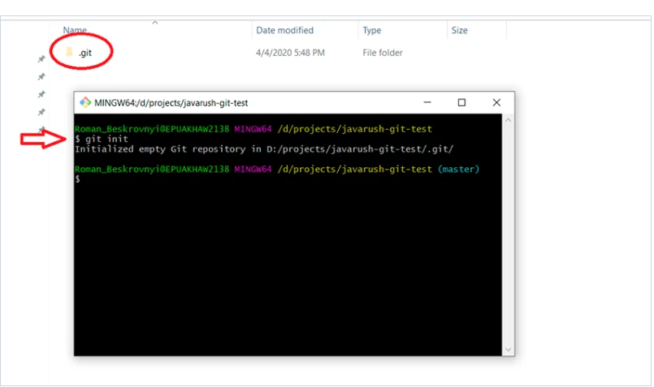
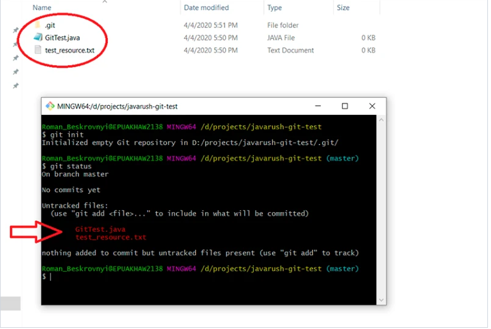
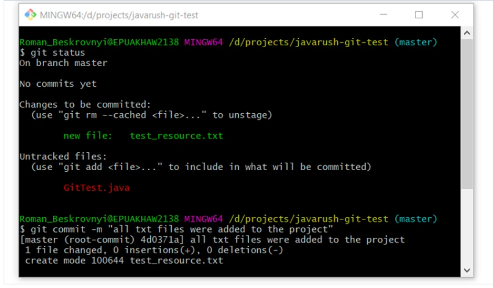
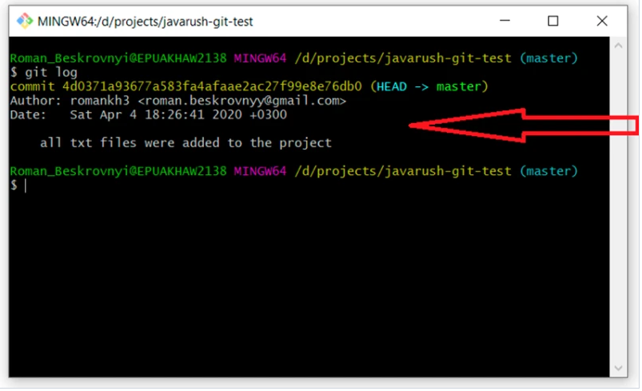

# Работа в локальном репозитории

---

Чтобы создать локальный репозиторий, необходимо ввести в командной строчке:

```
git init
```
После этого будет создана папка .git в том месте, где находится консоль.

.git — это папка, которая хранит всю информацию о гит репозитории.



Далее, добавляются файлы в этот проект, и их состояние становится Untracked. Чтобы посмотреть, какой статус работы на данный момент, пишем:

```
git status
```



Мы находимся в master ветке, и пока мы не перейдем в другую, так все и останется.

Таким образом видно, какие файлы изменены, но еще не добавлены в состояние staged. Чтобы добавить их в состояние staged, нужно написать git add. Здесь может быть несколько вариантов, например:

+ **git add** -A — добавить все файлы из состояния в staged;

+ **git add .** — добавить все файлы из этой папки и все внутренних. По сути тоже самое, что и предыдущее;
    
+ **git add <имя файла>** — добавляет только конкретный файл. Здесь можно пользоваться регулярными выражениями, чтобы добавлять по какому-то шаблону. Например, git add *.java: это значит, что нужно добавить только файлы с расширением java.

Ясно, что первые два варианта простые, а вот с добавлением будет интереснее, поэтому пишем:

~~~
git add *.txt
~~~

Чтобы проверить статус, используем уже известную нам команду:

~~~
git status
~~~

Последний этап (при локальном репозитории) — закоммитить и создать новый коммит:

```
git commit -m “all txt files were added to the project”
```



Далее есть отличная команда, чтобы посмотреть на историю коммитов в ветке. Воспользуемся ею:

```
git log
```



Здесь уже видно, что появился наш первый коммит с текстом, который мы передали. Очень важно понять, что текст, который мы передаем, должен максимально точно определять то, что было проделано за этот коммит. Это в будущем будет помогать множество раз.
