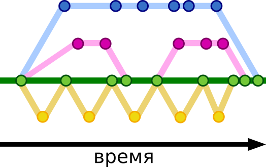

# Ветвление

---

При ведении разработки нередко приходится вести процесс разработки определенного функционала отдельно от основного проекта.

Создание различных версий репозиториев, отличных друг от друга и называется ветвлением. Приведём пример ветвления:

>Существует некий проект, назовём его «Суперсервис». У Суперсервиса три разработчика: Антон, Борис и Владимир.
>
>Основная задача Антона — решать ошибки, которые уже существуют в приложении. Задача Бориса — произвести некоторые изменения интерфейса. Владимир же разрабатывает новый функционал, требующий большого количество времени на разработку.
>
>Ошибки Антон решает в достаточно большом количестве и постоянно производит обновление версии пользователей, чтобы они больше не сталкивались с ошибкой. Борис совершает обновления ежедневно, большинство из правок не такие уж и большие, но некоторые должны представляться пользователю одновременно. Владимир ведёт разработку от простого к сложному — сначала реализует по частям базовые функции нового функционала, потом производит уже его постепенное усложнение.

Схематически их работа может выглядеть так:

**Кругами** изображены точки-фиксации изменений в репозитории (коммиты)

**Зелёная ветка** — ветка программы, которая доступна пользователям.

В самом начале все разработчики начали работу с одной и той же версией репозитория, однако в последствии каждый вносит и фиксирует свои изменения, что приводит к появлению версии программы, отличной от других.

При этом, в дальнейшем, все изменения, созданные разработчиками, вносятся в общую ветку. Кажется, что создание отдельных веток в этом случае излишне, ведь каждый разработчик может производить написание кода и фиксацию изменений в локальном репозитории, а после вынести свои изменения в общую ветку.

Теперь представим, что при решении очередной ошибки Антон не может разобраться в логике нового интерфейса Бориса и сообщает ему, что в новом интерфейсе есть ошибка. Что в этом случае должен сделать Борис? Решить ошибку и отменить изменения, связанные с очередными правками интерфейса? Выложить решение ошибки с новыми ошибками (незаконченные правки)? Решить ошибку и заставить пользователя ждать решения, пока, он допишет очередные изменения интерфейса? Созвониться с Антоном и объяснить что и как сделать?

Наиболее вероятное решение заключается в том, что Борис зафиксирует изменения, над которыми он работал, в отдельной ветке, а сам попытается решить ошибку, предоставив Антону возможность работать над другими ошибками. Это пример создания веток в локальном репозитории.

---

Создание ветки и переключение на ветку

**git branch** [наименование] — команда, которая создает новую ветку в репозитории.

**git checkout** [наименование] — команда, которая переключает вас на определенную ветку.

Можно совместить выполнение этих команд:

**git checkout -b** [наименование] — создаёт новую ветку и переключает вас на неё.

Объединение ветвей

**git merge** [наименование] — поглощение. Вносит коммиты из другой ветки в текущую.

**git rebase**[наименование] — перебазирование. В этом случае коммиты вашей ветки накладываются поверх текущего состояния указанной ветки.

